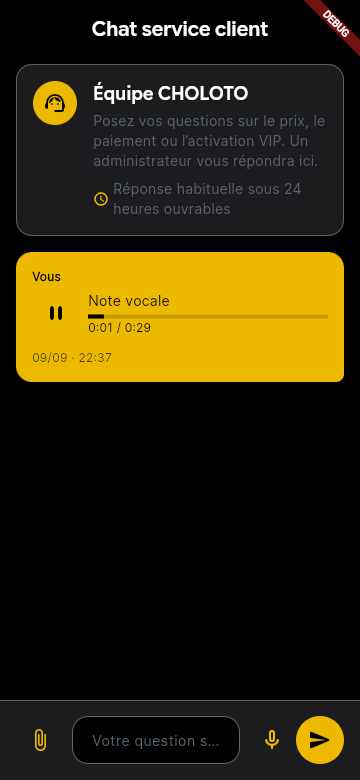

# Notes vocales du service client

Le chat client permet d’enregistrer une note de 30 secondes maximum, de l’écouter avant envoi, de la supprimer et de réessayer un envoi échoué. Le tableau de bord permet de lire les notes reçues. Un seul lecteur joue à la fois. Le micro s’arrête lorsque l’application passe en arrière-plan ; un brouillon n’est jamais envoyé automatiquement.

## Contrat conservé

- Les conversations, profils `/user/{uid}`, messages texte et pièces jointes `attachments/image` conservent leurs chemins et leurs formats.
- Un message vocal ajoute `attachment_type: audio` et garde un `text` traduit, affichable par les anciens clients.
- Le document `support_conversations/{conversationId}/messages/{messageId}/attachments/audio` contient `base64`, `mime_type: audio/wav`, `byte_length` et `duration_ms`.
- Le WAV mono PCM 16 bits à 8 kHz occupe au maximum 480 044 octets, soit 640 060 caractères Base64. Aucun accès Firebase Storage ni lien public supplémentaire n’est utilisé.
- Conversation, message et audio sont écrits atomiquement après lecture de la conversation, du message et de la pièce jointe, puis du profil si nécessaire. Les visiteurs conservent le contrat existant fondé sur leur identifiant privé de conversation.
- L’UID membre, l’accès administrateur explicite et les interdictions d’accès étranger restent en vigueur. Les notes sont immuables ; les métadonnées incohérentes, les notes sans pièce jointe et l’injection dans un ancien message texte sont refusées.
- Un nouvel essai du même brouillon réutilise son identifiant de message, y compris si une réponse administrateur est arrivée entre-temps.

## Validation locale

- Application : `flutter test test/theme_test.dart test/support_chat_view_test.dart test/support_conversation_test.dart test/support_voice_test.dart` — 52 tests réussis.
- Tableau de bord : `flutter test test/support_conversation_test.dart test/support_inbox_widget_test.dart test/support_audio_player_test.dart` — 10 tests réussis.
- Depuis `firebase/` : `firebase emulators:exec --only firestore,auth --project demo-choloto "node tests/firestore_rules_compatibility.mjs"` — suite historique, paiements et notes vocales réussies.
- Preuve de régression dans une copie temporaire : le nouveau test de première note échoue en 403 avec les règles antérieures, puis passe avec les règles modifiées.
- Compilation Android : `flutter build apk --debug` réussie. Aperçu Web compilé avec les plugins audio.
- Chrome local, microphone simulé : enregistrement PCM, arrêt automatique à 30 secondes, aperçu WAV, lecture/pause, envoi en mémoire et lecture du message envoyé vérifiés. Aucun message de test n’a été envoyé à Firebase de production.
- Captures et tests aux largeurs 320 et 1280, en français, anglais et créole, thèmes sombre et clair. Le clavier et le téléphone facultatif sont couverts par un test supplémentaire.
- `flutter analyze` a été exécuté dans les deux dépôts : aucune erreur ni alerte dans les composants vocaux ; les diagnostics préexistants du reste des projets demeurent.
- Les autorisations micro Android et iOS sont ajoutées, avec description iOS dans les trois langues. Aucun essai avec microphone physique Android/iOS n’a été réalisé.

## Mise en service

Les règles des notes vocales ont été déployées sur `choloto-6aa5b` avec autorisation explicite, via la configuration isolée [voice-only](../firebase/deployments/voice-only/README.md). Leur contenu publié a été vérifié. Cette intervention n’a déployé ni les permissions photos encore locales, ni les clients, ni le tableau de bord, ni Functions, Storage, index ou Hosting.

